# Challenge 18 NoSQL: Social Network API


## Table of Contents

- [Description](#description)
- [Installation](#installation)
- [Usage](#usage)
- [Credits](#credits)
- [License](#license)
- [Features](#features)
- [How-to-Contribute](#how-to-contribute)
- [Tests](#tests)
- [Questions](#questions)

## Description
```md
The task for this assignment was to build an API for a social network web application using MongoDB, express.js and the Mongoose ODM.  
The application was tested using Insomnia. I also used date-fns to format dates.
```

**User Story**

```md
AS A social media startup
I WANT an API for my social network that uses a NoSQL database
SO THAT my website can handle large amounts of unstructured data
```

**Acceptance Criteria**

```md
GIVEN a social network API
WHEN I enter the command to invoke the application
THEN my server is started and the Mongoose models are synced to the MongoDB database
WHEN I open API GET routes in Insomnia for users and thoughts
THEN the data for each of these routes is displayed in a formatted JSON
WHEN I test API POST, PUT, and DELETE routes in Insomnia
THEN I am able to successfully create, update, and delete users and thoughts in my database
WHEN I test API POST and DELETE routes in Insomnia
THEN I am able to successfully create and delete reactions to thoughts and add and remove friends to a user’s friend list
```

## Installation
<!-- audience is other developers -->

1. Clone this GitHub repo https://github.com/abrownstein2022/ch18-nosql-social-network-api
<!-- Check out the gh cli tool from github -->
```bash
$ gh repo clone /abrownstein2022/ch18-nosql-social-network-api
```

2. From the terminal, install npm, express, date-fns and moongoose 6.8.0 packages:

```bash
$ npm i
$ npm install express
$ npm install date-fns
$ npm install mongoose@6.8.0
```

## Usage
1. You will need 2 terminal sessions to use this application.

2. In one of the terminal sessions, start up the mongo server:
```bash
mongod
```
3. In the other terminal session, run the application:
```bash
$npm start
```

Or to start with nodemon

```bash
$npm run dev
```

**The screenshots below show different functionality of the application:**<br>
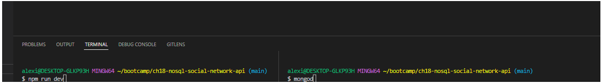

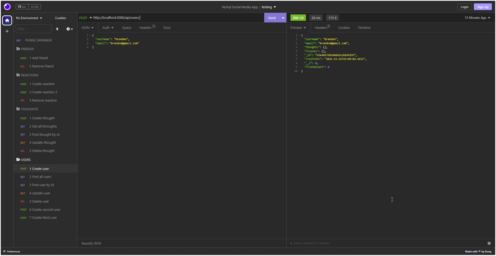

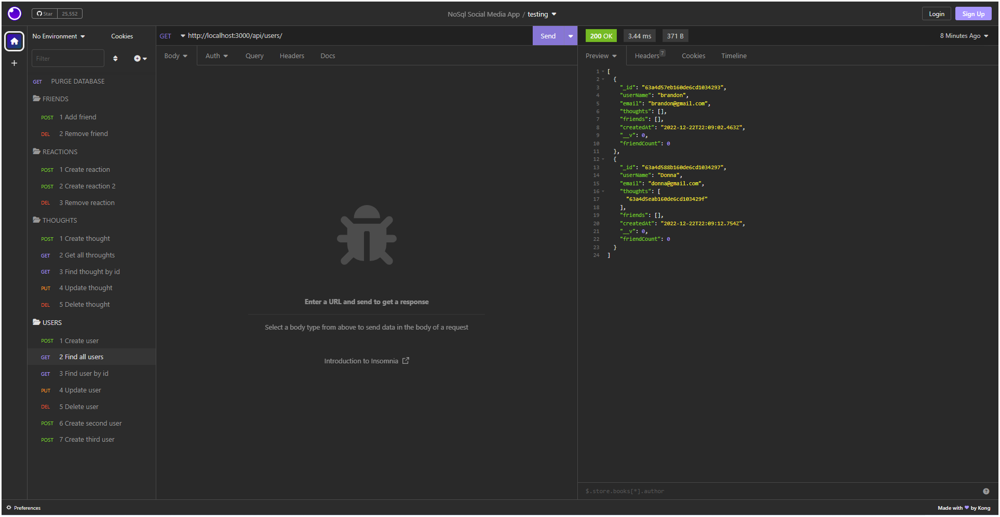

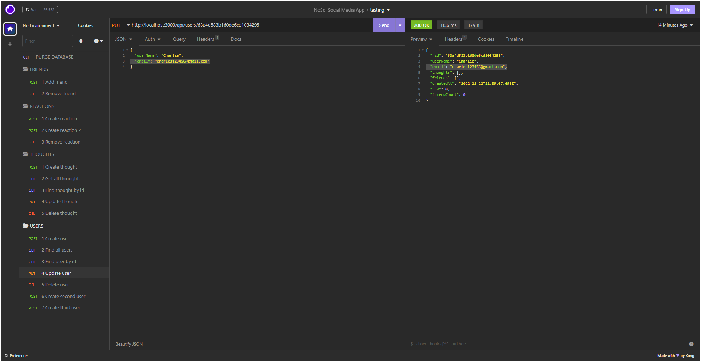

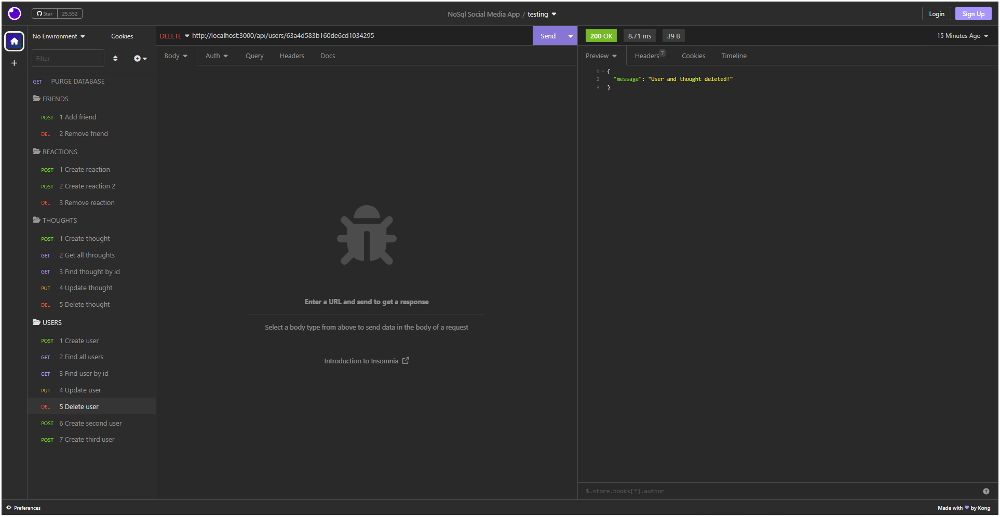

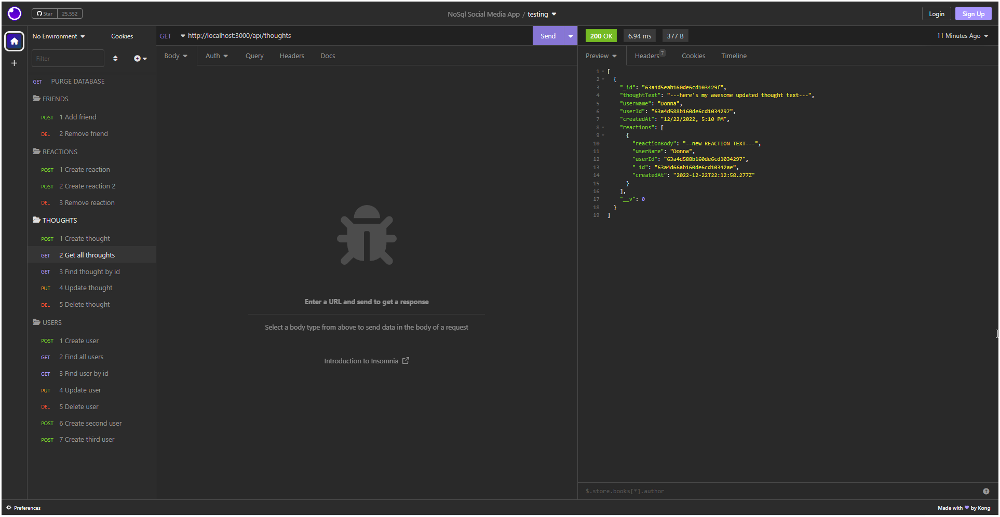

**Please review the demonstration video below to see, step-by-step, how the entire application works:**


**Please see the screenshots below to specifically review that thoughts are deleted when users are deleted.**

Run "find all users" to see no users have been created yet.
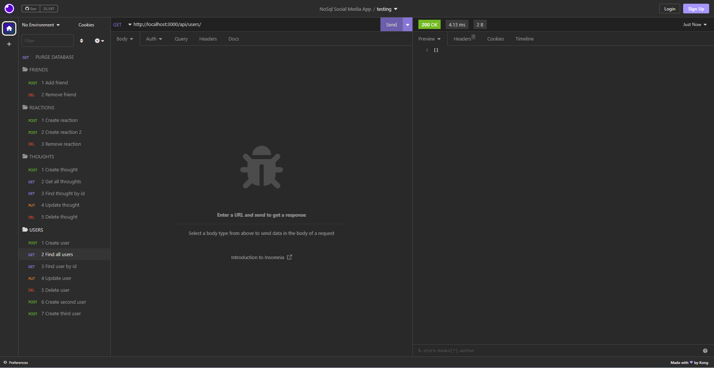

Create new user brandon.
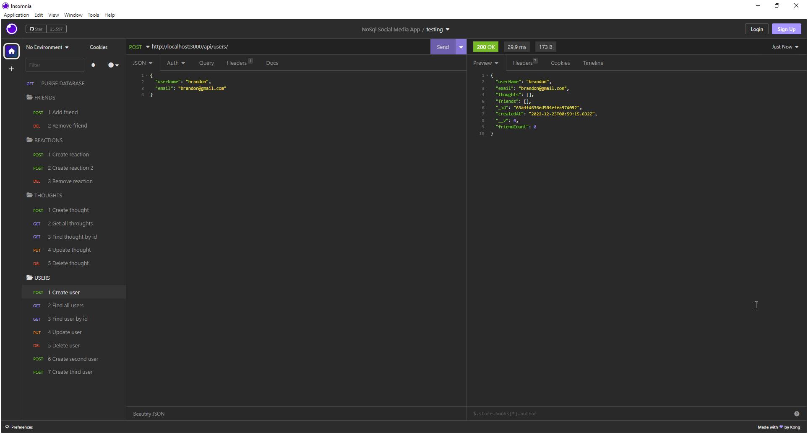

Create thought for user brandon.
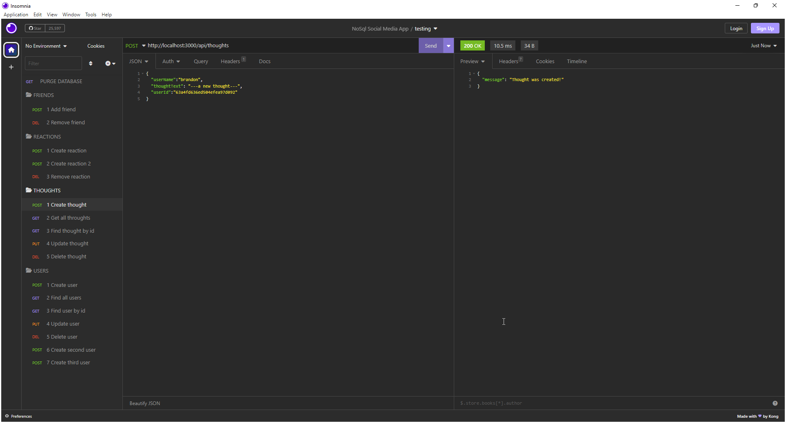

View all thoughts to confirm the new thought has been created for Brandon.
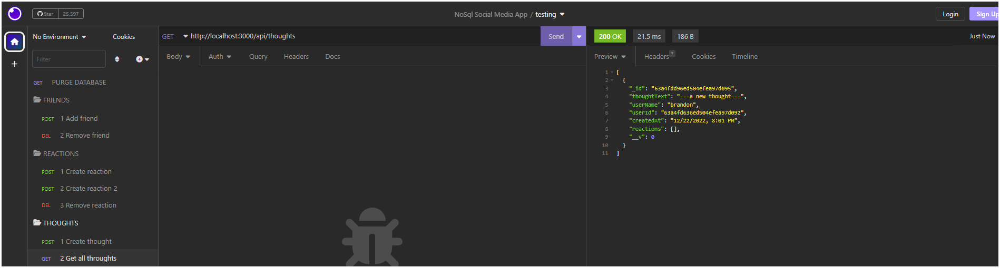

View all users to confirm again that the new thought has been tied to Brandon's userid. 
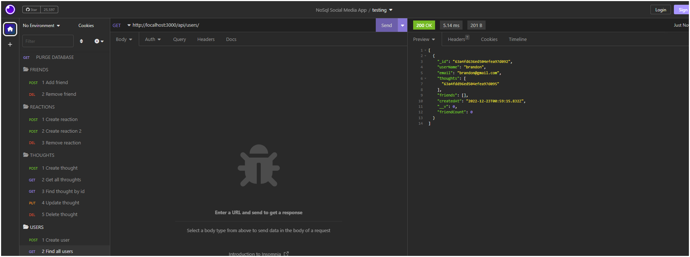

Delete the user.<br>
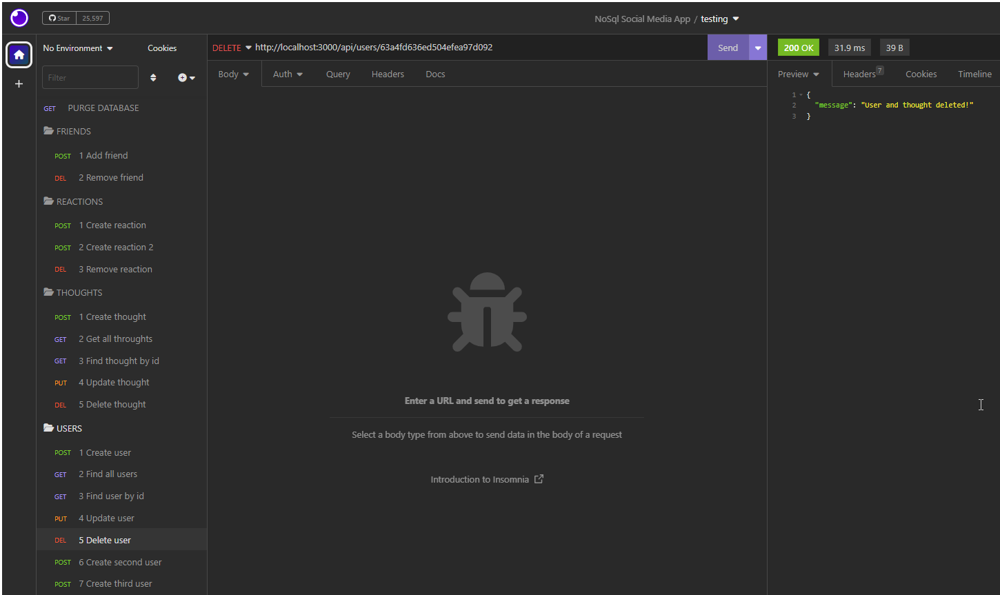

View all users to confirm user brandon has been deleted.
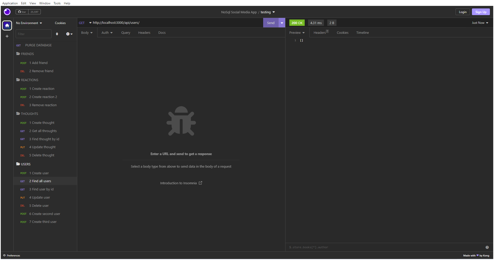

View all thoughts to confirm brandon's thought was also deleted. 
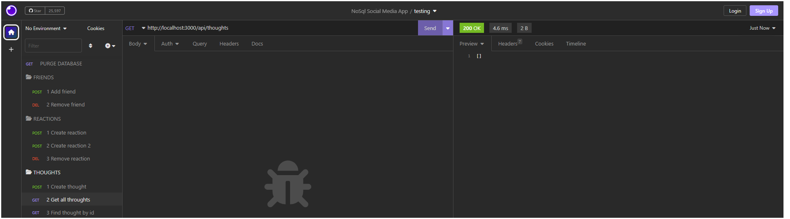

## Credits

```md
Alexis Brownstein, Wyzant tutor: Mike
```

## License

 ```md
 MIT 
```

Link to license text:
https://opensource.org/licenses/mit-license


## Features

<!-- 
# h1
###### h6
**bold**
*italic*
_underline_

| key | value |
|-|-|
| name | 'bob' |


- list
- items

1. numberd
1. list
1. all ones - automatic numbering
Features for *future* development
 -->
**The main features in this project are:**<br>
1. Uses Node.js, Inquirer, Express, Insomnia, Mongo DB and Mongoose
1. Example screenshots and a demonstration video
1. Necessary folder structure 
1. Professional README
1. Utils.js file in models folder to handle global functions used
1. date-fns used to format dates


## How-to-Contribute

N/A

## Tests

This application was tested with Insomnia using the routes below.

*USERS*
```md
`api/users`  
    - GET: return all users  
    - POST: create a new user  

`api/users/:user_id`  
    - GET: a single user by `_id`  
    - PUT: update a user by `_id`  
    - DELETE: delete a user by `_id`  (and also delete their thoughts if any exist)

`api/users/:user_id/friends/:friend_id`  
    - POST: add a new friend to the users list 
    - DELETE: remove a friend from the users friend list
```

*THOUGHTS*
```md
`api/thoughts`  
    - GET: get all thoughts  
    - POST: create a new thought  

`api/thoughts/:thought_id`  
    - GET: get a thought by its `_id`  
    - PUT: update a thought by its `_id`  
    - DELETE: delete a thought by its `_id`  

`api/thoughts/:thought_id/reactions`  
    - POST: create and add a reaction to the thoughts reactions list  
    - DELETE: delete a reaction by its thought id 
```

## Questions

Feel free to contact me with any questions.

I can be reached at alexis@drdatabase.com.

This GitHub repo can be found at:
  
https://github.com/abrownstein2022/ch18-nosql-social-network-api